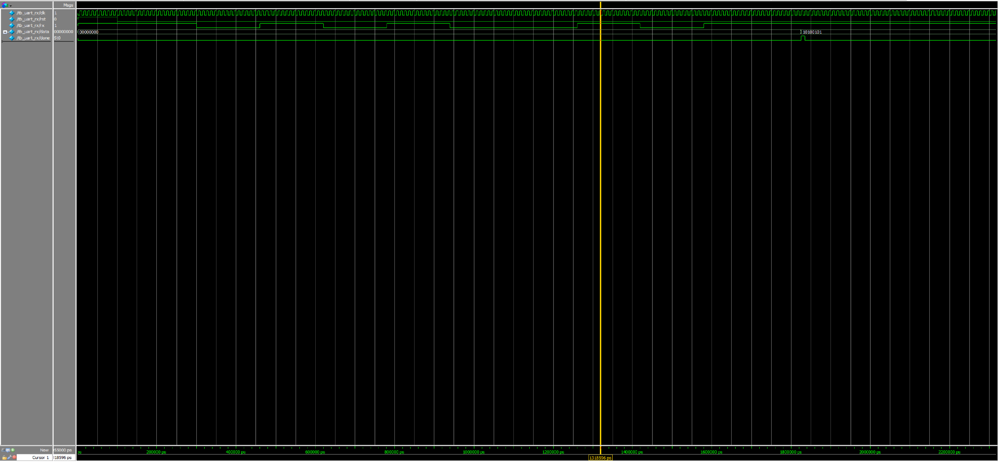

# UART_RX Test Project

This project implements a UART receiver (`uart_rx.v`) and its corresponding testbench (`tb_uart_rx.v`). It is designed for 16x oversampling with a 100 MHz clock input and demonstrates how to receive a UART byte through simulation.

## 🔧 Features

- UART RX module with start, data, stop bit detection
- 16x oversampling (for timing tolerance)
- Testbench for simulating UART transmission
- Simulation waveform and RTL block diagram included

## 🧠 Block Diagram (RTL)

The design uses a simple FSM (finite state machine) with 5 states: `IDLE`, `START`, `DATA`, `STOP`, `DONE_STATE`. Data bits are collected by oversampling at 16x clock speed and shifted into a register.

## 📈 Simulation Result

Below is the waveform when transmitting `0xA5` (binary `10100101`) via the UART line:

- Start bit: LOW
- Data bits: LSB first (`1-0-1-0-0-1-0-1`)
- Stop bit: HIGH

## 📁 File List

| File Name            | Description                             |
|---------------------|-----------------------------------------|
| `uart_rx.v`          | UART receiver RTL code                  |
| `tb_uart_rx.v`       | Testbench for simulating UART RX        |
| `RTL_uart_rx.png`    | Block diagram (generated from Quartus)  |
| `wave_tb_uart_rx.png`| Simulation waveform (from ModelSim)     |

## 🧪 How to Simulate

1. Use **ModelSim** to compile and simulate:
vlog uart_rx.v tb_uart_rx.v
vsim tb_uart_rx
run -all

2. View waveforms using:
add wave -r *

## 📌 Note

- This project is meant for **simulation only**, not synthesizable on hardware as-is (due to testbench and `$display`, `$time` system tasks).
- Please do not synthesize `tb_uart_rx.v` in Quartus.

## 🧑‍💻 Author

Huiching Chang
